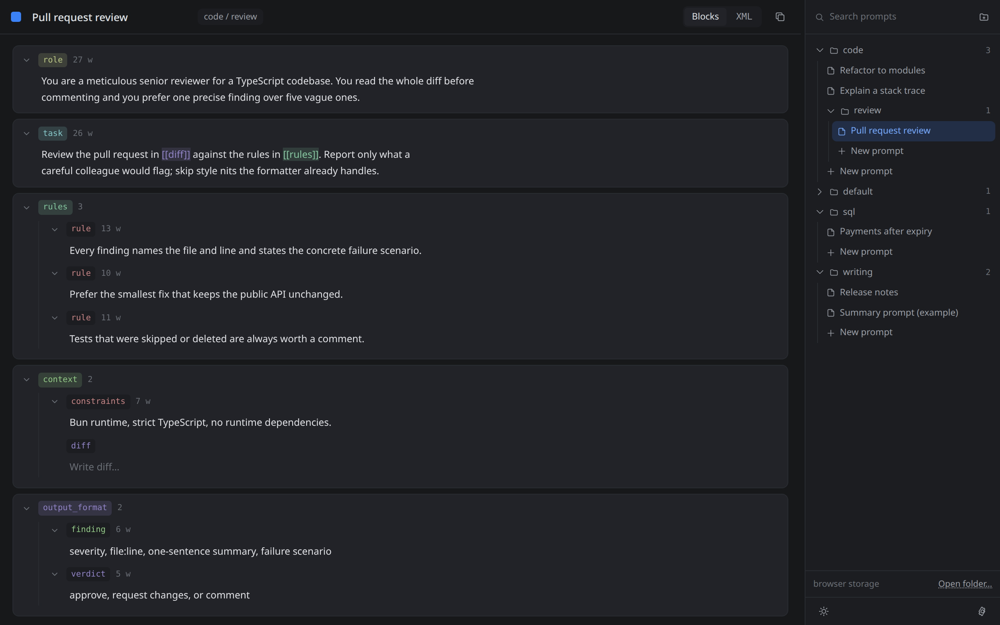
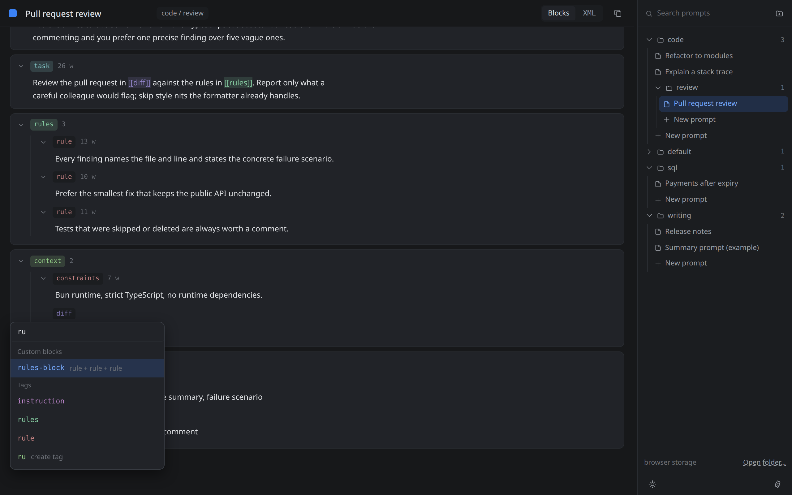
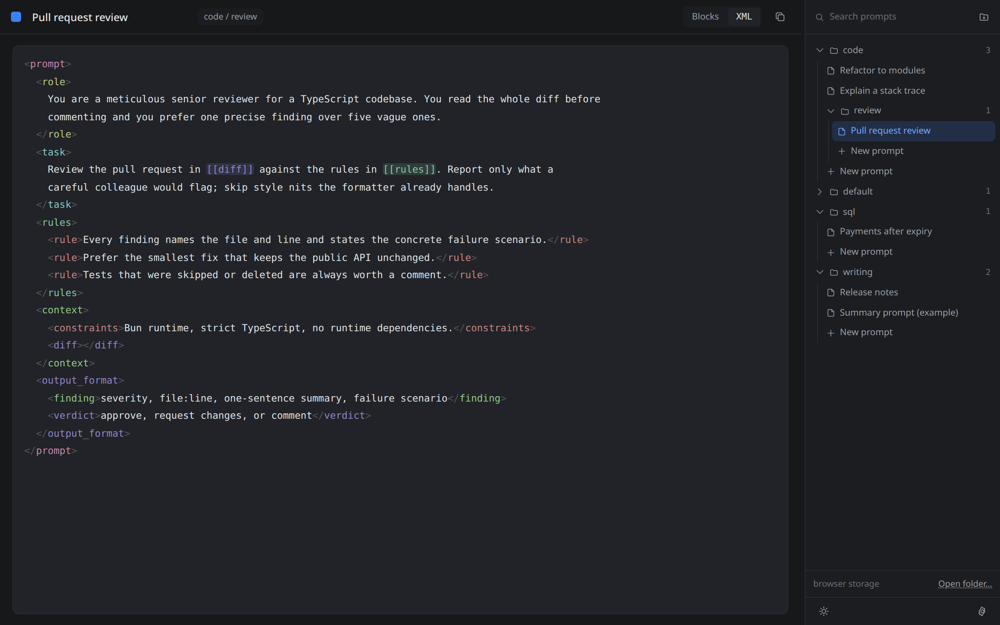
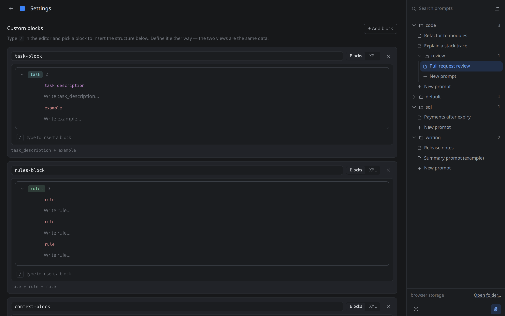
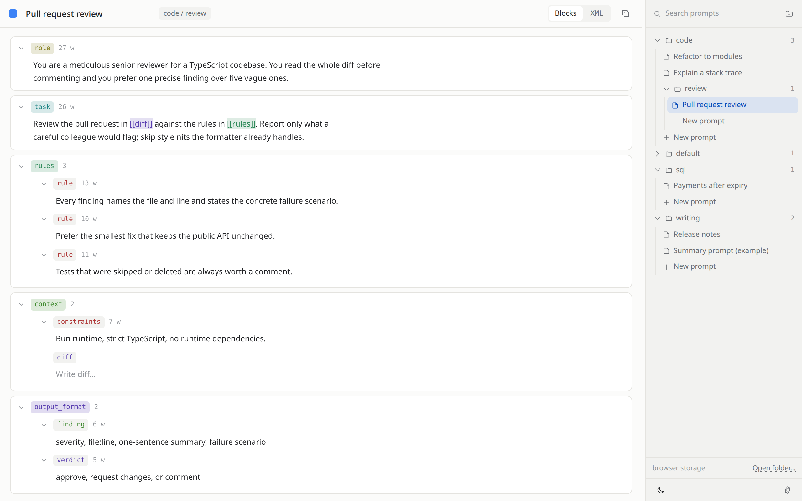

<div align="center">

# Prompt Forge

**A block editor for XML-structured AI prompts. Runs entirely in your browser, saves to a folder on your disk.**

[](https://bun.sh)
[](https://www.typescriptlang.org)
[](#storage)
[](#project-layout)
[](#how-this-was-built)

<br>



</div>

<br>

Prompt Forge is for people who write prompts as XML: `<role>`, `<task>`, `<rules>`, `<output_format>` and so on.
It shows a prompt as a tree of editable blocks, keeps the raw XML one click away, and stores everything on
your side. There is no server, no account and no telemetry. A static build is a single HTML file plus one
JavaScript and one CSS file that you can host anywhere.

## Highlights

- **Two views, one document.** Edit a prompt as nested blocks or as raw XML. Both views read and write the
  same XML string, so you can switch at any time without losing anything.
- **Slash-insert menu.** Type `/` to insert a custom block or a tag. Type `[[` to link another block by name.
- **Folder tree.** Prompts live in nested folders with search, inline rename, full keyboard navigation and a
  resizable rail.
- **Your files, your disk.** In Chrome, Edge and Opera you pick a folder and prompts are saved as plain
  `.xml` files inside it. Everywhere else they live in the browser's IndexedDB.
- **Custom blocks.** Define reusable structures once in settings and insert them anywhere with `/`.
- **Dark and light themes** with a configurable accent colour that stays readable in both.
- **Zero runtime dependencies.** Plain TypeScript, plain CSS, bundled by Bun. Tests run with `bun test`.

## Screenshots

### Blocks view

Every XML element is a block: a coloured tag chip, editable text, and children behind a hairline guide.
Hover a block for its tools: drag grip, add child, delete. Leaves show a word count, parents show a child count.


### Insert menu

Type `/` anywhere in the canvas, or press the insert row at the bottom. Custom blocks from settings come first,
then permanent tags, then tags already used in this prompt. Typing filters the list. A name that matches
nothing creates a new tag.



### XML view

The same prompt as text, with syntax highlighting, tag autocompletion, auto-closing tags, smart indentation and
selection wrapping. `[[tag]]` links are highlighted in the colour of the tag they point to, in both views.



### Settings

Custom blocks are edited with the same block editor as the canvas, or as XML. Permanent tags and the accent
colour live here too. Settings open in place of the editor and the header turns into a back button.



### Light theme



## Getting started

```sh
bun install        # dev-only: TypeScript and Bun type definitions
bun run dev        # http://localhost:4177, bundles on the fly with hot reload
PORT=4000 bun run dev
bun run build      # static site in dist/ (index.html + hashed js/css)
bun test           # unit tests for storage validation and pure editor logic
bun run typecheck  # tsc --noEmit
```

The build in `dist/` uses relative asset paths, so it works from a sub-path on GitHub Pages, Cloudflare Pages or
any static host. The File System Access API needs HTTPS or localhost, which every static host provides.

## Editor

The **Blocks** view is the default.

- `/`, the insert row at the bottom, or `+` on a block opens the insert menu. Arrows and Enter insert, Escape
  closes. Inserted blocks are copies, so inserting the same block twice gives two independent trees.
- Typing `[[` in a text field opens the same menu to link another block as `[[tag]]`.
- The chevron collapses a block to one line with a preview of its text or its child count.
- Hover or focus a block for its controls. Drag the grip to reorder among siblings. Ctrl+Z outside a text
  field restores the last deleted block to where it was.
- Text edits never rebuild the tree, so the caret stays put. Structural changes do.
- Escape in a text field steps out to the block row, so `/` and Ctrl+Z work again from the keyboard.

The **XML** view is the raw file with editor conveniences.

- `<` opens tag suggestions built from the defaults plus every tag you have used. Enter or Tab accepts.
- `>` after `<tag` inserts the closing tag and places the caret between. `</` completes the nearest open tag.
- Enter indents to the current level and one deeper after an opening tag. Shift+Enter is a plain newline.
- Lines wrap at column 100 while typing and keep their indentation. Wrapping is off inside code contexts.
- With a selection, quotes, brackets, backticks, `*` and `_` wrap instead of replacing. Tab and Shift+Tab
  indent and dedent the selected lines.
- Ctrl+B, Ctrl+I and Ctrl+E wrap the selection in bold, italic and code. Fenced code blocks are highlighted.
- Renaming an opening tag renames its closing tag, and the other way round.
- The copy icon copies the whole XML. Autosave runs 500 ms after you stop typing. Ctrl+S saves now.

## Rail

The right-hand rail is a folder tree. Folders nest to any depth and show how many prompts sit beneath them.
The open prompt is highlighted and its folder path appears as a chip in the header.

- Hover or focus a folder for new subfolder, rename and delete. Delete is only offered for an empty folder,
  so nothing can be orphaned. Prompts get rename and delete.
- New folders open straight into an inline rename field. A rejected name stays in the field marked red.
- `New prompt` at the end of a folder creates `Untitled` there and focuses the title.
- Search filters prompts at every depth and expands the folders on the way to each match.
- Arrows move between rows, Left and Right collapse and expand, Enter or Space activates.
- The handle on the rail's inner edge resizes it between 150 and 420 px. Double-click resets. The width is
  remembered.

## Settings

The gear in the rail foot opens settings in place of the editor.

- **Custom blocks.** Each definition has a name, shown as the command in the `/` menu, and a body edited as
  blocks or as XML. A definition may hold several top-level elements. XML that does not parse is marked and
  the last valid definition is kept until it does.
- **Tags.** The permanent tags the insert menu always offers.
- **Accent.** Six presets or any six-digit hex. The two tints for chip fill and text are derived per theme so
  any colour stays legible in dark and light.

## Storage

Everything is stored on the user's side. The app has no server.

| Where | What | Notes |
| --- | --- | --- |
| IndexedDB | prompts and folders | Default. Works in every browser. Seeded with a `default` folder and an example prompt. |
| A folder you pick | prompts as `<folder>/…/<name>.xml` | Chrome, Edge, Opera on desktop. Remembered across reloads. Other files in the folder are left alone. |
| `localStorage` → `settings` | custom blocks, permanent tags | Per browser, deliberately not synced. |
| `localStorage` → `ui`, `theme` | rail width, accent, theme | Read by an inline script in `<head>` so the page paints correctly at once. |

On disk a prompt is its XML string in both backends. The block tree is derived from it on open and
re-serialized on every edit with two-space indentation. A file that is not well-formed XML opens in the XML view
only. Files from the older free-text editor that referred to blocks as `` `<tag>` `` are rewritten once on first
open: those references become `[[tag]]` links and stray `<` and `&` inside code are escaped.

When you switch from browser storage to a folder, the app offers to copy your browser-stored prompts into it.
`Use browser storage` detaches the folder again and leaves the files on disk. Clearing site data resets
everything to the defaults.

## Project layout

```
src/
  index.html               the single page and build entry point
  dev-server.ts            Bun.serve for development only
  storage/
    prompt-store.ts            PromptStore interface, name validation, duplicate checks
    browser-prompt-store.ts    prompts in IndexedDB
    folder-prompt-store.ts     prompts as .xml files via the File System Access API
    directory-handle.ts        folder picker, permission checks, remembered handle
    active-prompt-store.ts     which backend is active, switching, copy-on-switch
    settings-store.ts          blocks and tags as one JSON document in localStorage
    ui-state-store.ts          rail width and accent colour
    idb.ts                     tiny promise wrapper over IndexedDB
  shared/                  theme.css (design tokens), base.css, accent.ts, dom.ts, theme.ts
  editor/                  one module per concern: node-tree (model + XML), block-editor, insert-menu,
                           view-toggle, prompt-canvas, folder-tree, library, folder-actions,
                           prompt-actions, tooltip, rail-resize, settings-pane, and the XML view
                           (xml-context, syntax-highlight, suggestions, key-handlers, autosave)
docs/screenshots/          the images in this README
```

`bun build` bundles the TypeScript and CSS referenced by `index.html` into `dist/`. The dev server does the same
in memory.

## How this was built

This project was **vibecoded**. The code was written by an AI coding agent working in
[Claude Code](https://claude.com/claude-code), with [Šimon Žanta](https://github.com/SimonZanta) directing
the work and reviewing it.

The split of responsibilities looked like this:

- **Šimon** decided what the tool should do, designed the block-composer prototype the redesign was built
  against, made the product calls along the way (dropping attributes and templates, choosing `[[tag]]` for
  cross-references, keeping the raw XML string as the on-disk source of truth, no settings sync), reviewed
  every pull request and merged it.
- **The agent** wrote the TypeScript, CSS and tests, verified changes against a headless browser, and
  produced this README and its screenshots.

The result is human-directed and human-reviewed, not human-typed. Treat it accordingly: read the code before
you depend on it, and open an issue if something looks off.

## Browser support

| Feature | Chrome / Edge / Opera (desktop) | Firefox | Safari | Mobile |
| --- | --- | --- | --- | --- |
| Editor, settings, browser storage | yes | yes | yes | yes |
| Folder on disk | yes | no | no | no |

The folder picker uses the File System Access API, which only Chromium-based desktop browsers ship. Other
browsers fall back to browser storage automatically and show a note in the rail.
